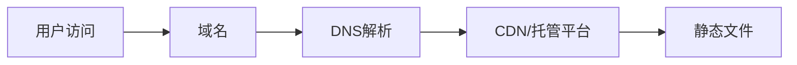

# CineAI - AI长视频创作平台

> 新一代AI长视频创作平台，让每个人都能轻松创作专业级视频内容。

## 📋 项目概述

CineAI 是一个面向中文用户的 AI 长视频生成平台，支持：
- **文生视频 (Text-to-Video)** — 通过文字描述生成视频
- **图生视频 (Image-to-Video)** — 通过参考图片生成视频
- **智能编辑** — AI 驱动的视频编辑工具
- **AI 配音与音效** — 自动生成配音和背景音乐
- **角色一致性** — 跨镜头保持角色一致性
- **长视频分镜** — 60秒以上的长视频多镜头叙事

## 🏗️ 项目结构

```
cineai/
├── index.html          # 首页 - 品牌展示、核心功能、工作流程、定价预览
├── create.html         # 创作中心 - AI视频生成交互界面
├── pricing.html        # 定价页面 - 4档定价卡片 + 完整功能对比表
├── about.html          # 关于我们 - 使命、价值观、技术架构、联系方式
├── css/
│   └── style.css       # 全局样式 (33KB) - 完整设计令牌系统、响应式布局
├── js/
│   └── main.js         # 全局脚本 (8.6KB) - 导航、动画、FAQ、定价切换、创作模拟
└── assets/             # 静态资源目录（图片、字体等）
```

## 🎨 设计系统

### 品牌
- **名称**: CineAI
- **定位**: AI长视频创作平台
- **目标用户**: 中文创意人群（社交媒体创作者、独立电影人、品牌营销团队）

### 视觉语言
| 元素 | 取值 |
|------|------|
| 主题 | 深色模式 |
| 主色 | #7C3AED (紫色) |
| 强调色 | #06B6D4 (青色) |
| 渐变 | 紫色 → 青色渐变 |
| 背景 | #0F0F1A (深空蓝黑) |
| 卡片 | #252538 |
| 字体 | Inter (系统无衬线) |

### 设计灵感来源
参考 Runway (深色+科技感)、Synthesia (信任信号+免费试用)、Kling AI (工具卡片式)、PixVerse (沉浸式创作) 等竞品的最佳设计模式。

## 🚀 部署方案

### 方案一：静态托管（推荐，零成本起步）

由于 CineAI 是纯静态网站（HTML + CSS + JS），可部署到任何静态托管平台：

#### 1. Vercel（推荐）
```bash
# 1. 安装 Vercel CLI
npm install -g vercel

# 2. 部署
cd cineai
vercel --prod
```
- 免费套餐：100GB带宽/月，无限请求
- 自动 HTTPS、CDN 加速
- 支持自定义域名

#### 2. Cloudflare Pages
```bash
# 通过 Git 连接或直接上传
```
- 免费套餐：无限带宽，500次构建/月
- 全球 CDN，极低延迟
- 支持自定义域名 + 免费 SSL

#### 3. GitHub Pages
```bash
# 在 GitHub 上创建仓库并推送
git init
git add .
git commit -m "Initial commit"
git remote add origin https://github.com/yourname/cineai.git
git push -u origin main

# 在仓库 Settings > Pages 中启用：选择 main 分支 / (root)
```
- 完全免费
- 自动 HTTPS
- 域名：`yourname.github.io/cineai`

#### 4. 阿里云 OSS + CDN（国内推荐）
```
1. 创建 OSS Bucket（选择靠近目标用户的区域）
2. 上传所有文件
3. 开启静态网站托管
4. 绑定 CDN 加速域名
5. 配置自定义域名和 HTTPS 证书
```
- 国内访问速度快
- 需备案域名
- 费用：OSS 存储约 ¥9/月 + CDN 流量费

### 方案二：域名购买与配置



#### 域名购买平台
| 平台 | 特点 |
|------|------|
| 阿里云万网 | 国内首选，需实名+备案 |
| 腾讯云DNSPod | 国内，赠送SSL证书 |
| Namecheap | 国际，无需备案 |
| GoDaddy | 国际，品类丰富 |
| Cloudflare Registrar | 成本价，无加价 |

#### 域名建议
- **国际**: cineai.ai, cineai.io, cineai.tv, cineai.video
- **国内**: cineai.cn, cineai.com.cn (需备案)

#### DNS 配置示例（以 Vercel 为例）
```
记录类型: CNAME
主机记录: @
记录值: cname.vercel-dns.com
TTL: 600
```

### 方案三：后续扩展（生产环境）

如需添加后端功能（用户系统、支付、API代理等），推荐架构：

```
用户 → Cloudflare CDN → Vercel (前端静态) 
                     → 阿里云/腾讯云 (后端 API + 数据库)
                     → GPU 推理集群 (视频生成)
```

## 🧪 本地预览

```bash
# 使用 Python 启动本地服务器
cd cineai
python -m http.server 8080
# 访问 http://localhost:8080

# 或使用 Node.js
npx serve cineai
```

## 🌐 浏览器兼容性

- Chrome 90+
- Firefox 90+
- Safari 15+
- Edge 90+
- 移动端浏览器（iOS Safari / Android Chrome）

## 📄 页面功能清单

### 首页 (index.html)
- [x] 固定导航栏（滚动变色）
- [x] 移动端汉堡菜单
- [x] 英雄区：品牌标语 + 主CTA + 统计数据 + 浮动徽章
- [x] 核心功能展示（6张卡片）
- [x] 四步创作流程
- [x] 精选作品展示
- [x] 定价预览（4档方案）
- [x] FAQ 手风琴
- [x] CTA 行动号召
- [x] 完整页脚

### 创作中心 (create.html)
- [x] 侧边栏工具切换（5种工具）
- [x] 提示词输入区（带辅助工具按钮）
- [x] 参数面板（模型选择/时长滑块/分辨率/风格）
- [x] 生成按钮 + 模拟加载状态
- [x] 视频预览区（空状态 + 生成结果模拟）
- [x] 剩余次数显示

### 定价页面 (pricing.html)
- [x] 月付/年付切换（年付省20%）
- [x] 4档定价卡片（含「最受欢迎」标签）
- [x] 完整功能对比表（15项功能 × 4档）
- [x] 定价FAQ
- [x] CTA引导

### 关于页面 (about.html)
- [x] 使命宣言
- [x] 核心价值观（3张卡片）
- [x] 技术架构展示
- [x] 联系信息

## 🔮 后续可扩展功能

1. **用户注册/登录系统** — 邮箱/微信/Google OAuth
2. **真实 AI 模型接入** — 接入 Runway API / Kling API / PixVerse API
3. **作品管理** — 个人创作历史库
4. **分享与协作** — 视频分享链接、团队协作空间
5. **视频模板市场** — 社区模板上传与下载
6. **多语言国际化** — i18n 支持英文/日文等
7. **PWA 离线支持** — Service Worker 缓存
8. **支付集成** — 微信支付/支付宝/Stripe

---

**设计制作**: CineAI Team | **最后更新**: 2026年7月
